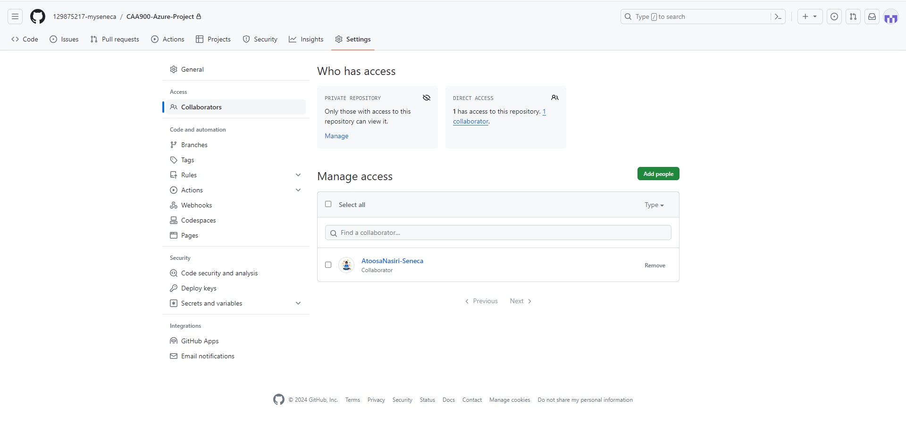
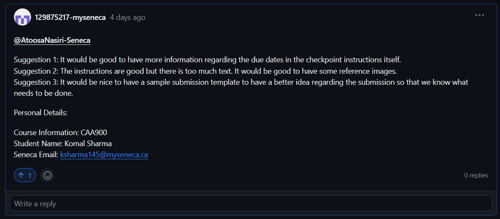

# Checkpoint1 Submission

- **COURSE INFORMATION: CAA900ZAA.08425.2241-Capstone Project**
- **STUDENT’S NAME: Komal Sharma**
- **STUDENT'S NUMBER: 129875217**
- **GITHUB USER_ID: 129875217-myseneca**
- **TEACHER’S NAME: Atoosa Nasiri**

---
## Table of Content
- [My Collaborator image](#my-collaborator-image)
- [Single Line Code Snippet](#single-line-code-snippet)
- [Multiple Line Code Snippet](#multiple-line-code-snippet)
- [Sample Json Object](#sample-json-object)
- [Sample Table](#sample-table)
- [Collaboration Comment](#collaboration-in-gitHub-suggestions)
- [Adding Hyperlink ](#adding-hyperlink)
  

### My Collaborator Image


### Single Line Code Snippet
This is an example of how to embed a single line code snippet in markdown
`sudo apt-get update`

### Multiple Line Code Snippet
This is an example of how to embed a multiple line code snippet in markdown

``` bash
# Use this code to deploy the terraform code in cloud 9
terraform plan #use to check what all changes will be done when the code is deployed
terraform apply -auto-approve #use this to approve the changes and deploy the code
```

### Sample json object

This is an example of json object
```json
{  
    "employee": {  
        "name":       "sonoo",   
        "salary":      56000,   
        "married":    true  
    }  
}
```

### Sample Table
|                |Important Dates                 |In Table Format                 |
|----------------|-------------------------------|-----------------------------|
| Name |`Komal`            |`Sharma`            |
| Important Dates For me       |`Lets Start`            |<table>  <thead>  <tr>  <th>Date</th>  <th>Occassion</th>  </tr>  </thead>  <tbody> <tr> <td> 14th Sept 1994 </td> <td> 'Birthday' </td> </tr>  <tr>  <td>29th January 2021</td>  <td>'Engagement'</td> <tr>  <td>28th June 2021</td> <td>'Wedding'</td> </tr> </tbody>  </table>      |

### Collaboration in GitHub - Suggestions
Suggestion: @AtoosaNasiri-Seneca

Suggestion 1: It would be good to have more information regarding the due dates in the checkpoint instructions itself.
Suggestion 2: The instructions are good but there is too much text. It would be good to have some reference images.
Suggestion 3: It would be nice to have a sample submission template to have a better idea regarding the submission so that we know what needs to be done.

Personal Details:

Course Information: CAA900
Student Name: Komal Sharma
Seneca Email: ksharma145@myseneca.ca

Link to the suggestion: -[Komal's Suggestion](https://github.com/orgs/Azure-Project-Winter2024/discussions/19?sort=old#discussioncomment-8203262)

Suggestion's Image:


### Sample Hyperlink
- [A cool image](https://robohash.org/komal?set=set4)

