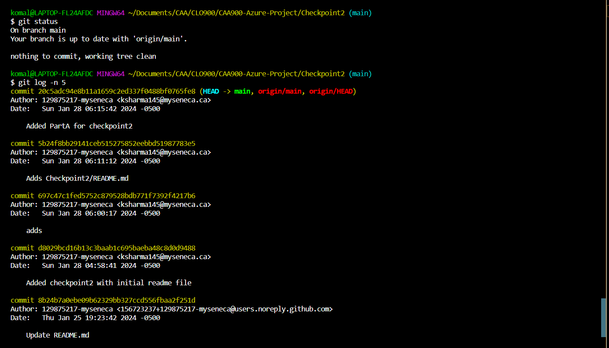

# Checkpoint2 Submission

- **COURSE INFORMATION: CAA900ZAA.08425.2241-Capstone Project**
- **STUDENT’S NAME: Komal Sharma**
- **STUDENT'S NUMBER: 129875217**
- **GITHUB USER_ID: 129875217-myseneca**
- **TEACHER’S NAME: Atoosa Nasiri**

---

## Table of Contents
1. [Part A - Adding Files - Local Repo Workflow](#adding-files-local-repo-workflow)
2. [Part B - Inspecting Local Repo with `git status` and `git log`](#inspecting-local-repo-with-git-status-and-git-log)
3. [Part C - Creating & Merging Branches](#creating-and-merging-branches)
4. [Part D - Git Branching Strategy Review Question](#git-branching-strategy-review-question)

### Adding Files Local Repo Workflow

Here are the link for the files added for each status change. You can also find these files in the checkpoint2 repository.

[Untracked Changes](git_status_untracked.txt)
[Uncommitted Changes](git_status_uncommitted.txt)
[Commited Changes](git_status_committed.txt)

### Inspecting Local Repo with git status and git log

Here is the screenshot for the git status and git log command:

### Creating and Merging Branches
### Git Branching Strategy Review Question