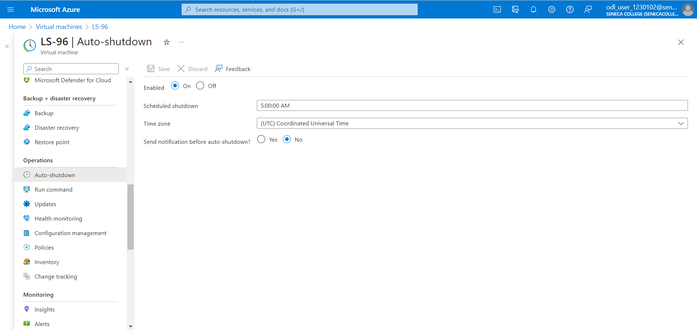

# Checkpoint4 Submission

- **COURSE INFORMATION: CAA900ZAA.08425.2241-Capstone Project**
- **STUDENT’S NAME: Komal Sharma**
- **STUDENT'S NUMBER: 129875217**
- **GITHUB USER_ID: 129875217-myseneca**
- **TEACHER’S NAME: Atoosa Nasiri**

---

## Table of Contents
1. [Part A - Creating Network Resources using Azure CLI](#creating-network-resources-using-azure-cli)
2. [Part B - Working with Azure CLI Bash](#working-with-azure-cli-bash)
3. [Part C - Network Review Questions](#network-review-questions)
4. [Part D - Creating Virtual Machines](#creating-virtual-machines-using-azure-cli)
5. [Part E - Creating Custom Images](#creating-custom-images-from-vms-using-azure-cli)
6. [Part F - Clean Up your Environment](#clean-up-your-environment-using-azure-cli)

### Creating Network Resources using Azure CLI

1. In network_config_test.sh what does `if [[ ! $(az group list -o tsv --query "[?name=='$RG_NAME']") ]]` do? Explain your answer.
This is a conditional statement which is checking the resource group in azure using az group list and then the query is checking for a specific resource group that we have specified. This command check if the resource group exist in the azure account or not.

2. Why is it crucial to check if a resource exist before creating it? What bash syntax do you use to test this? How do you check if a `vnet` exists in vnet_create.sh?
The reason why it is important to check if any resource exist is to make sure there is no duplicate that gets created or any overwrite that happen for the resource in question. If there is any resource that already exist it might result in an error or any unexpected behaviour.We use a conditional statement to check this. if [[ $(az network vnet list -g $RG_NAME -o tsv --query "[?name=='$vnet']") ]]; is the statement we used in vnet_create.sh.

3. What is the Azure CLI command to create `vnet`? Give the specific command as per your environment and unique ID configuration. What are the required and what are the optional parameters that you need to pass to it?
az network vnet create is the CLI command used to create vnet. the command used in the script is az network vnet create -g Student-RG-1230102 --name Router-96 --location canadacentral --address-prefix 192.168.96.0/24

4. What is the Azure CLI command to create `subnet`? Give the specific command as per your environment and unique ID configuration. What are the required and what are the optional parameters that you need to pass to it?
az network vnet subnet create is the CLI command to create a subnet in the specified vnet. az network vnet subnet create --name SN1 -g Student-RG-1230102 --vnet-name Router-96 --address-prefix 192.168.96.0/24

### Working with Azure CLI Bash

1. List all VNETs using `az network vnet list` command and send the output in `json` format to `vnet_list.json`file

[vnet_list.json](bash-scripts/vnet_list.json)

2. Get the details of your `default student vnet` using `az show` command and send the output in `json` format to `student_vnet.json` files

[student_vnet.json](bash-scripts/student_vnet.json)

3. List all peerings using `az network vnet peering list` command and send the output in `table` format to `peerings.tbl`file

| AllowForwardedTraffic | AllowGatewayTransit | AllowVirtualNetworkAccess | DoNotVerifyRemoteGateways | Name                    | PeeringState | PeeringSyncLevel | ProvisioningState | ResourceGroup       | ResourceGuid                          | UseRemoteGateways |
|-----------------------|---------------------|---------------------------|---------------------------|-------------------------|--------------|------------------|-------------------|---------------------|----------------------------------------|-------------------|
| True                  | False               | True                      | False                     | Student-Bastion1230102 | Connected    | FullyInSync      | Succeeded         | Student-RG-1230102  | 7edafa6d-65f2-0a66-3b9b-c3ba1f47bac0   | False             |
| True                  | False               | True                      | False                     | StudenttoRouter         | Connected    | FullyInSync      | Succeeded         | Student-RG-1230102  | ac120069-20c5-07bf-2183-aacd48a79287   | False             |

4. Get the details of your `Router-XX` subnet `SN1` using `az show` command in `json` format and `query` it for details of subnet and rout associations. 

[router_subnet_details.json](bash-scripts/router_subnet_details.json)

5. List all routes in `RT-xx` using `az network route-table route list` command and send the output in `table` format to `route_list.

| AddressPrefix   | HasBgpOverride | Name             | NextHopIpAddress | NextHopType      | ProvisioningState | ResourceGroup     |
|-----------------|----------------|------------------|------------------|------------------|-------------------|-------------------|
| 172.17.96.32/27 | False          | Route-to-Server  | 192.168.96.36    | VirtualAppliance | Succeeded         | Student-RG-1230102|
| 10.28.202.0/24  | False          | Route-to-Desktop | 192.168.96.36    | VirtualAppliance | Succeeded         | Student-RG-1230102|

6. Get the details of route between your `Router-xx SN1` and `Server-xx SN` using `az network route-table route show` and send the output in `json` format to `route_details.json`

[route_details.json](bash-scripts/route_details.json)

### Network Review Questions

1. What is Azure Virtual Network (VNET)? 
Azure Virtual Network (VNET) is a fundamental building block in Azure networking that enables us to securely connect our Azure resources and extend our on-premises network to the cloud. It acts as a logical representation of our network in the cloud, allowing us to define and control IP address ranges, subnets, route tables, and network security policies.

2. In the context of Hybrid Cloud architecture. How on-prem computers can access resources inside Azure virtual network?
In a Hybrid Cloud architecture, on-premises computers can access resources inside an Azure Virtual Network through various connectivity options such as VPN (Virtual Private Network) or ExpressRoute. VPN establishes a secure connection over the internet between the on-premises network and Azure VNET using encrypted tunnels.

3. What are the most important benefits of Azure Virtual Networks? Elaborate in your own words. 
Isolation and Segmentation: VNETs provide isolation for resources, allowing us to segment our network into multiple subnets for better organization and security.
Scalability: VNETs can scale horizontally to accommodate growing workloads and vertically to support increased traffic demands.
Connectivity Options: Azure VNETs offer various connectivity options, including VPN and ExpressRoute, enabling seamless integration with on-premises networks and other Azure services.
Security: We can enforce network security policies using Network Security Groups (NSGs) and control traffic flow with route tables, ensuring compliance and protection against unauthorized access.
Customization: VNETs allow customization of IP address ranges, subnets, and DNS settings to meet specific requirements and accommodate diverse workloads.
High Availability: Azure provides built-in redundancy and high availability features for VNET infrastructure, minimizing downtime and ensuring reliability.

4. What is the difference between Network Security Group (NSG) and Route-Tables?
NSG is a firewall-like security feature that filters network traffic based on source and destination IP addresses, ports, and protocols whereas Route tables define the routing paths for network traffic within a virtual network.

5. What is the difference between NSG and Firewalls?
NSG operates at the network layer (Layer 3) of the OSI model, filtering traffic based on IP addresses, ports, and protocols whereas Firewalls operate at the application layer (Layer 7) of the OSI model, inspecting traffic at a more granular level and enforcing security policies based on application-specific rules. 

6. What is a _hob-and-spoke_ network topology and how be deployed in Azure Cloud?
A hub-and-spoke network topology in Azure consists of a central hub network (VNET) connected to multiple spoke networks (VNETs). The hub serves as a central point for connectivity and governance, while the spokes represent isolated environments for different departments, applications, or workloads. 

7. In working with Azure VNETs, do you need to to define gateways for Azure to route traffic between subnets?
Gateways are required in Azure VNETs when establishing connectivity between virtual networks or extending on-premises networks to Azure.

8. When do you need to configure and use Virtual Network Gateways?
Virtual Network Gateways are configured and used in Azure to establish secure connectivity between on-premises networks, remote users, and Azure VNETs. They are required when setting up site-to-site VPN connections, point-to-site VPN connections, or ExpressRoute circuits. 

### Creating Virtual Machines using Azure CLI

1. List all VMs and send the output in `table` format to `vm_list.tbl` file. What command did you use?
az vm list --resource-group Student-RG-1230102 --output table > vm_list.tbl
| Name  | ResourceGroup      | Location       | Zones |
|-------|--------------------|----------------|-------|
| LR-96 | Student-RG-1230102 | canadacentral |       |
| LS-96 | Student-RG-1230102 | canadacentral |       |
| WC-96 | Student-RG-1230102 | canadacentral |       |
| WS-96 | Student-RG-1230102 | canadacentral |       |

2. Get the details of your `WC-99` using `az show` command and send the output in `json` format to `WC-99-details.json` file. What command did you use?
az vm show --name WC-96 --resource-group Student-RG-1230102 --output json > WC-96-details.json
[WC-96-details.json](bash-scripts/WC-96-details.json)

3. List all NSG using `az list` command and send the output in `table` format to `nsg_list.tbl`file. What command did you use?
az network nsg list --resource-group Student-RG-1230102 --output table > nsg_list.tbl
| Location       | Name       | ProvisioningState | ResourceGroup      | ResourceGuid                          |
|----------------|------------|-------------------|--------------------|---------------------------------------|
| canadacentral | LR-NSG-96  | Succeeded         | Student-RG-1230102 | 4633500a-9017-4044-958f-e8941c8b8984 |
| canadacentral | LS-NSG-96  | Succeeded         | Student-RG-1230102 | 035027ad-caa7-4821-b269-38616409ee87 |
| canadacentral | WC-NSG-96  | Succeeded         | Student-RG-1230102 | 8e1616e7-2935-4073-9693-2c5558c0277d |
| canadacentral | WS-NSG-96  | Succeeded         | Student-RG-1230102 | d8e965f8-21e0-4d93-8f5f-80b53235a914 |

4. Provide screenshot of _auto shutdown configuration_ for `LS_XX`. Is there any command to show this? What is the time-zone? What should be the correct time settings considering the time zone differences?
Here is the screenshot of autoshutdown configuration:

The time zone for auto-shutdown configuration is based on the Azure portal settings, typically set to UTC by default. We should change the time zone to our current time zone to have the correct time.

5. Why `auto shutdown configuration` is not done in vm_create code? Why is it a separate scripts? Is it possible to configure auto shutdown at the same time you are creating the VM?
Auto-shutdown configuration is not included in the vm_create script because it's typically a separate operational task and might vary based on different requirements or policies. While it's possible to configure auto-shutdown at the same time as creating the VM by using Azure Resource Manager (ARM) templates or Azure CLI commands, it's often separated to keep scripts focused on specific tasks and maintain simplicity and clarity in code management.

### Creating Custom Images from VMs using Azure CLI

1. What are the difference between the script that creates VM from Azure Generic Image vs Custom Image? A good place to start is to compare the two scripts `custom_vm_create.sh` and `custom_vm_create.sh` and check the parameters passed to `az vm create` command. Elaborate the differences you observe.
2. If you run `custom_vm_create.sh` without custom image `version` number, the script will throw an error and show you the usage suggestion. What is the usage suggestion?
3. The script is purposefully written such that it waits on each custom image creation to be completed before proceeding to next image. Can you update the script such that custom images creation runs in background, i.e. how can you parallelize the process?_Hint: only provide the single line command that you need to update_
4. Once all custom images are successfully created, run a command in CLI that lists all your Custom Images. Change the output format to table format and embed the answer in your submission.
5. Delete your VMs using the proper script after above step is completed. Then re-create VMs using your custom images. Check is all VMs are accessible, i.e. Client VM can be reached via Bastion and Linux VMs can be accessed with ssh.
6. Get a list of your VM, NSG, NIC, Disks, and Custom Iamges using Azure CLI in table format. Which ones are empty? **Do not include screenshots, just embed the output in **table** format in your submission.

### Clean Up your Environment using Azure CLI

Answer below questions for this section:

1. After deleting list all your VMs using `az  vm list ...` with the output in `table` format. What command did you use? How can you ensure all your VMs are deleted?
2. Why you are not asked to delete Custom Images? What is the difference between VM and Custom Image that makes VM a very costly resource and Custom Images, negligible? (_Hint: It is related to OS Disk_)
3. What are cost implications of NSG or NIC? Why are you deleting them?
4. Why you are not deleting Network backend like VNET and Route-Tables?

