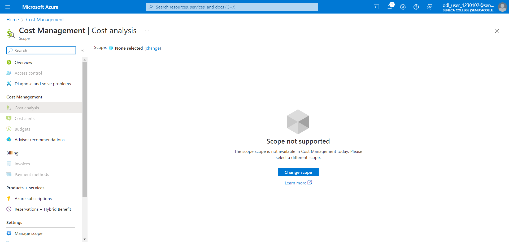
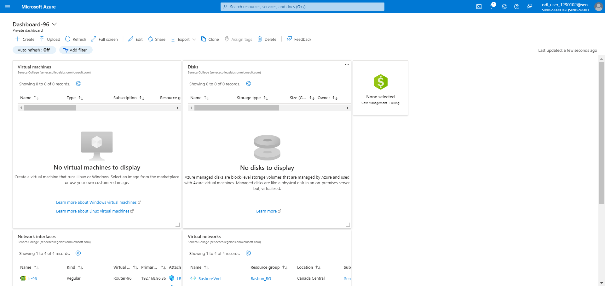

# Checkpoint6 Submission

- **COURSE INFORMATION: CAA900ZAA.08425.2241-Capstone Project**
- **STUDENT’S NAME: Komal Sharma**
- **STUDENT'S NUMBER: 129875217**
- **GITHUB USER_ID: 129875217-myseneca**
- **TEACHER’S NAME: Atoosa Nasiri**

### Table of Contents

1. [Part A - Basic Connectivity - Linux VMs Firewall Setting](#part-a---basic-connectivity---linux-vms-firewall-setting)
2. [Part B - Azure Cost Analysis Charts](#part-b---azure-cost-analysis-charts)

## Part A - Basic Connectivity - Linux VMs Firewall Setting

1. The current configuration we use sets all chains (INPUT, FORWARD, and OUTPUT) to ACCEPT, meaning it permits all incoming, outgoing, and forwarded traffic without any limitations, posing a security risk. To enhance security, we should consider setting the default policy for these chains to DROP. This change will ensure that only the traffic that has been specifically authorized will be allowed through.

2.
```bash

sudo hostnamectl status

Static hostname: LR-96.CAA900-2241.com
         Icon name: computer-vm
           Chassis: vm
        Machine ID: 4007b8bf80da47aa94c2a4aa87e2a381
           Boot ID: 039588fb0d0a480b842d8d58fbc12f93
    Virtualization: microsoft
  Operating System: Red Hat Enterprise Linux 8.9 (Ootpa)
       CPE OS Name: cpe:/o:redhat:enterprise_linux:8::baseos
            Kernel: Linux 4.18.0-513.11.1.el8_9.x86_64
      Architecture: x86-64

   Static hostname: LS-96.CAA900-2241.com
         Icon name: computer-vm
           Chassis: vm
        Machine ID: 4007b8bf80da47aa94c2a4aa87e2a381
           Boot ID: 28941fd16a3247d39be93d15d974efbe
    Virtualization: microsoft
  Operating System: Red Hat Enterprise Linux 8.9 (Ootpa)
       CPE OS Name: cpe:/o:redhat:enterprise_linux:8::baseos
            Kernel: Linux 4.18.0-513.11.1.el8_9.x86_64
      Architecture: x86-64

```
3.
[LR IPTable](./lr_iptable.txt)
[Ls_IPTable](./ls_iptable.txt)

4. The connectivity is there between client and the servers

## Part B - Azure Cost Analysis Charts

1. Cost Analysis Chart:


2. Dashboard:

